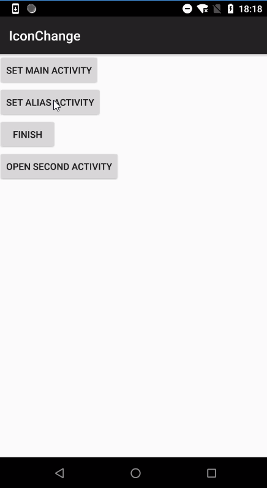

# IconChange

动态更换应用ICON

# 多应用ICON切换

优化代码设计，再增加应用ICON类型，只需要以下两步：

- 1、在AndroidManifest.xml文件中添加activity-alias
- 2、在IconChangeManager的ICON_ARR数组中增加activityPath

# 限制

- 1、只能替换预埋在应用内的icon，不能替换网络图片（未尝试过）；
- 2、只能在应用退出的时候更换icon，有两个原因：1、系统刷新icon时间较长；2、系统刷新icon可能会杀死应用；
- ~~3、icon切换为activity-alias标签中指定的图片后，AndroidStudio不能运行安装。需要切回activity标签中指定的图片，才可以运行安装；~~

解决方案：

1、在AndroidManifest.xml文件中为activity和activity-alis设置scheme，例如：

```xml
<intent-filter>
    <action android:name="android.intent.action.VIEW" />

    <category android:name="android.intent.category.DEFAULT" />
    <category android:name="android.intent.category.BROWSABLE" />

    <data
        android:host="icon_change"
        android:path="/main"
        android:scheme="fqxyi" />
</intent-filter>
```

2、打开Run/Debug Configurations弹框，修改General页面中的Launch Options，详细请看图：


- 4、AndroidManifest.xml文件中添加过activity-alias标签之后，下一版本不能删除，`可能`会导致应用升级异常：

以工程中的activity（MainActivity），activity-alias（activity618、activity1225）为例，且在升级包中删除了activity-alias（activity1225），则会有以下两种情况：

情况一：已安装应用的enable activity非activity1225，为MainActivity或activity618，则能正常升级；

情况二：已安装应用的enable activity为activity1225，升级完成后桌面上将找不到该应用，通过`设置`界面可以搜索到该应用的应用信息。

结论：一旦在AndroidManifest.xml文件中定义过activity-alias，`建议不要删除`。

# GIF



# 参考文章

- [Android动态修改应用图标和名称](https://juejin.im/post/5c36f2226fb9a049b7809170)